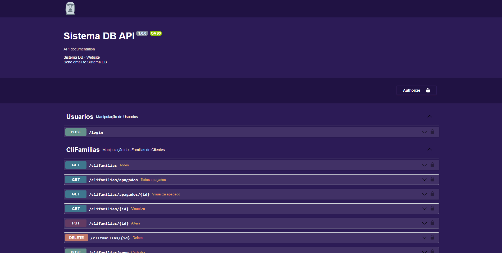

# sistemadb

## 🔧 Funções:

### Banco de Dados:

- Criação automática do banco de dados atravez da biblioteca sequelize, trazendo para o projeto a possibilidade de utilização em diversos bancos de dados por padrão.
- Controle de novas versões do banco automatizado atravez do migrations dentro do sequelize.
- Criação de seed para alimentar tabelas com valores padrões de funcionamento

### API:

- Criação de uma API utilizando a biblioteca express, com controle de acesso por token JWT.
- Documentação da API utilizando o componente Rapi-Doc.

O projeto ainda está em desenvolvimento e as próximas atualizações serão voltadas nas seguintes tarefas:

- [x] Clientes
- [x] Clientes Famílias
- [x] Telefones
- [x] Endereços
- [x] Países
- [x] Municípios
- [x] CNAE
- [x] Unidades
- [x] Formas de Pagamento
- [x] Lojas
- [x] Manipulação do Banco de Dados
- [x] Autenticação JWT
- [x] Grupo de Funcionários
- [x] Cargos de Funcionários
- [x] Funcionários
- [x] Usuários
- [x] Produtos Famílias
- [x] Produtos Estoques
- [x] Produtos Armazéns
- [x] Produtos Fórmulas
- [x] Produtos
- [x] Fornecedor Códigos de Produtos Link
- [x] CFOPs
- [x] Cotação Cabeçalho
- [x] Cotação Itens
- [x] Cotação Status
- [x] Pedido Compra Cabeçalho
- [x] Pedido Compra Itens
- [x] Pedido Compra Status
- [ ] Tabela de Preços
- [ ] Pedido Cabeçalho
- [ ] Pedido Itens
- [ ] Nota Cabeçalho
- [ ] Nota Itens
- [ ] ...

## 💻 Pré-requisitos

Antes de começar, verifique se você atendeu aos seguintes requisitos:

- Você instalou a versão mais recente de `<Node.js,NPM,YARN>`
- Você instalou um desses servidores de dados `<SQL Server,Postgres,mysql2,mariadb,sqlite3>`
- Você criou um banco de dados novo dentro do servidor de dados escolhico
- Voce baixou esse projeto atraves do comando git clone

```
git clone https://github.com/rafaelwdornelas/sistemadb.git
```

- Entre na pasta do projeto:

```
cd sistemadb
```

- Faça a instalação das bibliotecas do projeto:

```
yarn install
```

- Configurou a conexão do bando de dados dentro do arquivo ./api/config/config.json

## 💻 Funções Iniciais do Bando de Dados:

- Criar o banco de dados, tabelas e dados inicias:

```
node iniciabancodedados.js
```

## 💻 Iniciando a API:

```
yarn start
```

## 💻 Acessar a Documentação local da API:

http://localhost:37778/api-docs

[](http://localhost:37778/api-docs)
